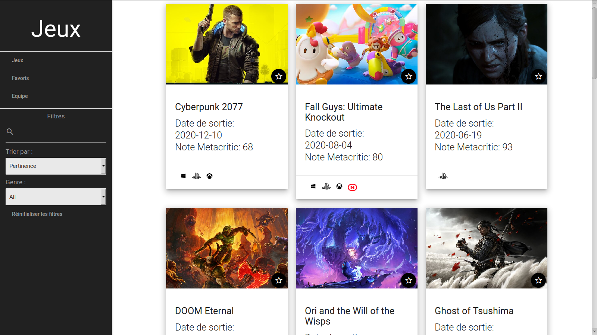
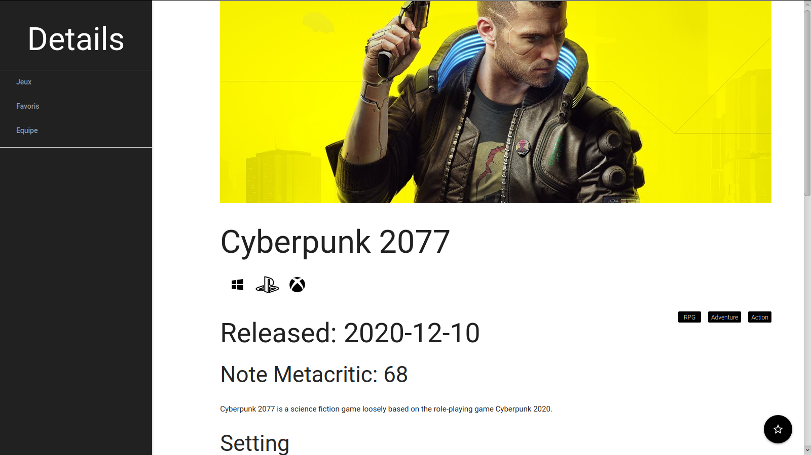
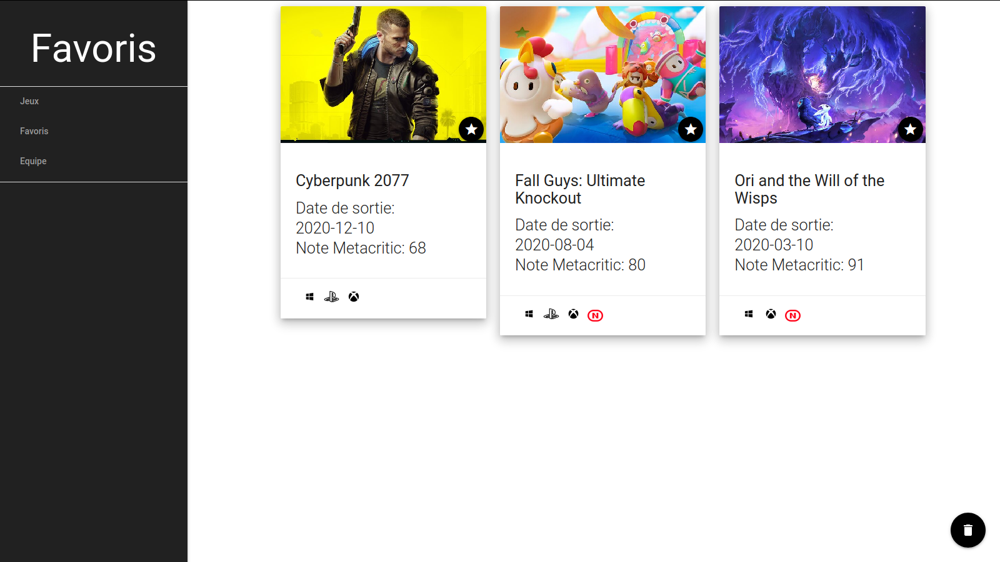
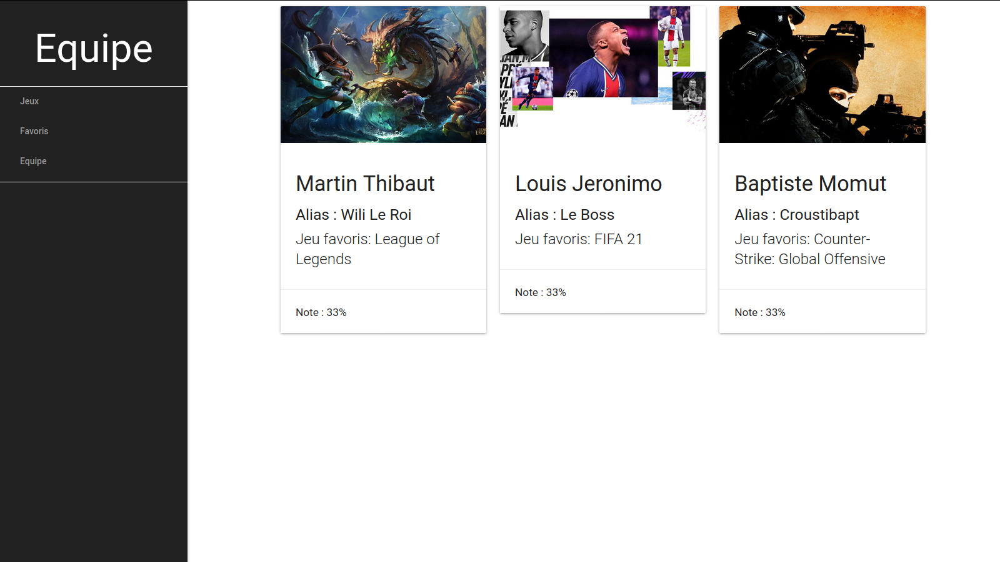

## Projet 2021 Thibaut-Jeronimo-Momut <!-- omit in toc -->

- [A. Lancement du projet](#a-lancement-du-projet)
- [B. Captures Écrans](#b-captures-écrans)
- [C. Correction ](#c-correction)

## A. Landement du projet

Pour lancer l'application, il faut faire les instructions suivantes : 
```
Dans un terminal dans le répertoire du projet :
    $ npm install
    $ nmp run watch
    $ npx serve -s -l 8000

Dans un navigateur : 
    http://localhost:8000
```

## B. Captures Écrans

**Page d'accueil / Listes des jeux :**



**Page de détails d'un jeu :**



**Page de favoris :**



**Page de l'équipe :**


## C. Correction

